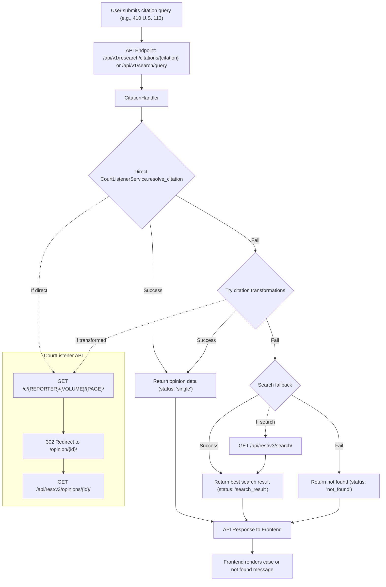

# CourtListener Integration

This document describes the CourtListener API integration for citation resolution and case lookup in the Deep Legal Research Platform.

## Overview

The CourtListener integration provides instant citation resolution, allowing users to type a citation like "410 U.S. 113" and immediately see the case. If the direct lookup fails, the system gracefully falls back to search-based approaches.

## Architecture

### Core Components

1. **CourtListenerService** (`app/services/courtlistener.py`)
   - Handles direct API communication with CourtListener
   - Parses citations and resolves them to opinion IDs
   - Fetches opinion data and text

2. **CitationHandler** (`app/services/citation_handler.py`)
   - Orchestrates the citation resolution process
   - Implements fallback strategies when direct resolution fails
   - Handles citation transformations and search fallbacks

3. **API Endpoints** (`app/api/v1/endpoints/`)
   - `/api/v1/research/citations/{citation}` - GET citation lookup
   - `/api/v1/research/citations` - POST citation lookup
   - `/api/v1/search/query` - Unified query endpoint with type parameter

## How It Works

### Architecture Diagram



### 1. Direct Citation Resolution

The system first attempts direct citation resolution using CourtListener's `/c/` endpoint:

```
GET https://www.courtlistener.com/c/U.S./410/113/
→ 302 Redirect to /opinion/108713/roe-v-wade/
→ Fetch opinion data from /api/rest/v3/opinions/108713/
```

### 2. Citation Transformations

If direct resolution fails, the system tries common transformations:

- **Reporter variations**: "U.S." → "US", "U S", "United States"
- **Spacing variations**: "410U S113" → "410 U.S. 113"
- **Format variations**: "F.2d" → "F. 2d", "F2d"

### 3. Search Fallback

If transformations fail, the system extracts search terms and uses CourtListener's search API:

- Extracts case names (e.g., "Roe v. Wade" from "Roe v. Wade 410 U.S. 113")
- Performs keyword searches
- Returns the best match with confidence indicators

## API Usage

### Citation Lookup

```bash
# GET request
curl "http://localhost:8000/api/v1/research/citations/410%20U.S.%20113"

# POST request
curl -X POST "http://localhost:8000/api/v1/research/citations" \
  -H "Content-Type: application/json" \
  -d '{"citation": "410 U.S. 113"}'
```

### Unified Query Endpoint

```bash
# Citation query
curl -X POST "http://localhost:8000/api/v1/search/query" \
  -H "Content-Type: application/json" \
  -d '{
    "query": "410 U.S. 113",
    "type": "citation"
  }'

# Search query
curl -X POST "http://localhost:8000/api/v1/search/query" \
  -H "Content-Type: application/json" \
  -d '{
    "query": "Roe v Wade",
    "type": "search",
    "max_results": 10
  }'
```

## Response Formats

### Successful Citation Resolution

```json
{
  "status": "single",
  "opinion_url": "https://www.courtlistener.com/opinion/108713/",
  "text": "<p>Roe v. Wade opinion text...</p>",
  "citation": "410 U.S. 113",
  "opinion_id": 108713,
  "source": "CourtListener"
}
```

### Transformed Citation

```json
{
  "status": "single",
  "opinion_url": "https://www.courtlistener.com/opinion/108713/",
  "text": "<p>Roe v. Wade opinion text...</p>",
  "citation": "410 U.S. 113",
  "opinion_id": 108713,
  "source": "CourtListener",
  "transformed_from": "410U S113"
}
```

### Search Result

```json
{
  "status": "search_result",
  "opinion_url": "https://www.courtlistener.com/opinion/108713/",
  "text": "<p>Roe v. Wade opinion text...</p>",
  "citation": "410 U.S. 113",
  "opinion_id": 108713,
  "source": "CourtListener",
  "search_term": "Roe v Wade",
  "confidence": "low"
}
```

### Not Found

```json
{
  "status": "not_found",
  "message": "Could not find case for citation: 999 Foo. 1",
  "citation": "999 Foo. 1"
}
```

## Configuration

### Environment Variables

```env
# Optional: CourtListener API key for authenticated requests
COURT_LISTENER_API_KEY=your_api_key_here
```

### Settings

The integration uses the following settings from `app/config/settings.py`:

- `COURT_LISTENER_API_KEY`: API key for authenticated requests
- `MAX_CITATION_EXPANSION`: Maximum number of citation transformations to try

## Testing

### Unit Tests

```bash
# Run CourtListener service tests
pytest tests/test_courtlistener.py -v

# Run citation handler tests
pytest tests/test_citation_handler.py -v

# Run API integration tests
pytest tests/test_api_integration.py -v
```

### Integration Test

```bash
# Run the integration test script
cd backend
python test_courtlistener_integration.py
```

## Error Handling

The integration includes comprehensive error handling:

1. **Network errors**: Graceful fallback with logging
2. **Invalid citations**: Clear error messages
3. **API rate limits**: Respectful request handling
4. **Missing data**: Fallback to available text formats

## Performance

- **Direct resolution**: ~200-500ms
- **Transformation attempts**: ~1-2s
- **Search fallback**: ~2-3s
- **Total fallback time**: ~3-5s

## Limitations

1. **CourtListener dependency**: Requires CourtListener API availability
2. **Citation format**: Primarily supports US legal citations
3. **Rate limiting**: Subject to CourtListener API limits
4. **Text quality**: Depends on CourtListener's text extraction

## Future Enhancements

1. **Caching**: Implement Redis caching for frequently accessed cases
2. **Multiple sources**: Add support for CAP API and other sources
3. **Pin cite precision**: Support for specific page references
4. **Batch processing**: Handle multiple citations in a single request
5. **LLM integration**: Use AI to suggest better search terms

## Troubleshooting

### Common Issues

1. **404 errors**: Check citation format and try transformations
2. **Network timeouts**: Verify internet connectivity and CourtListener availability
3. **Rate limiting**: Implement exponential backoff for retries
4. **Text extraction**: Fallback to plain text if HTML is malformed

### Debug Logging

Enable debug logging to see detailed resolution steps:

```python
import structlog
structlog.configure(processors=[structlog.dev.ConsoleRenderer()])
```

## Contributing

When extending the CourtListener integration:

1. Add tests for new functionality
2. Update documentation
3. Follow the existing error handling patterns
4. Consider performance implications
5. Add logging for debugging 